# Build the Backend System for a Car Website

In this project, I used my skills with Spring Boot, APIs, documentation, and testing to implement a Vehicles API that serves as an endpoint to track vehicle inventory. While the primary Vehicles API will perform [CRUD operations](https://en.wikipedia.org/wiki/Create,_read,_update_and_delete) (Create, Read, Update and Delete) related to vehicle details like make, model, color, etc., it will need to consume data from other APIs as well regarding location and pricing data. You will implement a RESTful API for the Vehicles API, as well as converting a Pricing Service API to a microservice.

By the end of this project, you'll have an application that can communicate with other services and be able to be viewed and used through Swagger-based API documentation.

This project used java 11, therefore I used `Amazon Corretto 11.0.24` as it is based on OpenJDK 11.

I used Intellij, and I prefare that each of the microservice are opened in separate intellij IDE.

**Microservices**

1. Location Service Code
2. Price Service Code
3. Vehicles API Code

## Location Service Code

You'll find the code related to our location service in the `boogle-maps` folder. It serves as a Mock to simulate a Maps WebService where, given a latitude and longitude, will return a random address.


`boogle.maps`

**Address**

This declares the Address class, primarily just made of the private variables address, city, state and zip. Note that the latitude and longitude are not stored here - they come from the Vehicles API.

**BoogleMapsApplication**

This launches Boogle Maps as a Spring Boot application.

**MapsController**

This is our actual REST controller for the application. This implements what a `GET` request will respond with - in our case, since it is a Mock of a WebService, we are just responding with a random address from the repository.

**MockAddressRepository**

Repositories normally provide some type of data persistence while the web service runs. In this case, this Mock is simply choosing a random address from the `ADDRESSES` array defined in the file.

I tested the API via commandline: `curl http://localhost:9191/maps\?lat\=20.0\&lon\=30.0`

It returned:

```json
{
    "address":"100 Thruway Plaza","city":"Cheektowaga","state":"NY","zip":"14225"
}

```
## Pricing Service Code

You'll find the code related to our pricing service in the `pricing-service` folder. It serves as a REST WebService that simulates a backend to store and retrieve the price of a given vehicle. In the project, you will convert it to be a microservice registered through a Eureka server.

Let's take a quick look through the included files, only certain files of which you will need to implement.


`pricing`

**PricingServiceApplication**

This launches the Pricing Service as a Spring Boot application

`pricing.api`
**PricingController**

This is our actual REST controller for the application. This implements what a GET request will respond with - in this case, a randomly generated price gathered from the `PricingService`. Once converted to a microservice, the Controller should not be explicitly necessary

`pricing.domain.price`
**Price**

This declares the Price class, primarily just made of the private variables currency, price and vehicleId.

**PriceRepository**

This repository provide a type of data persistence while the web service runs, namely the ID->price pairing generated by the `PricingService`.


`pricing.service`
**PriceException**

This creates a `PriceException` that can be thrown when an issue arises in the PricingService.

**PricingService**

The Pricing Service does most of the legwork of the code. Here, it creates a mapping of random prices to IDs, as well as the method (in our mock service here) to generate the random prices. Once converted to a microservice, the Service should not be explicitly necessary.

### Testing Pricing Service

Make sure SDK is 11, From Project Settings/Project/ SDK: `corretto-11`
Run the to see if the pricing service is working: runs at port `8082`

I ran `http://localhost:8082/services/price` but got whitelabel Error Page.
That means that I have to access this api via another microservice.

### Instructions

* Convert the Pricing Service to be a microservice.
* Add an additional test to check whether the application appropriately generates a price for a given vehicle ID.

#### Convert to Microservice


**Eureka Server**
Configure Eureka Server via [Spring initializr](https://start.spring.io/):

* Project: Maven
* Language: Java
* Spring Boot: 3.3.3
* Project Metadata:
  * Group: com.udacity
  * Artifact:eureka
  * Name: Eureka
  * Description: Demo project for Spring Boot to connect other Microservices
  * Package name: com.udacity.eureka
  * packaging: Jar
  * Java: 17
* Dependencies:
  * Eureka Server


* downloaded `eureka` into directory; `PO2-VehiclesAPI` same directory as, `boogle-maps`, `pricing-service`, `util`, `vehicles-api`.
* Open Eureka Server with intellij and Go to `application.properties`
* Go to Project Structure and Apply : `SDK: Oracle OpenJDK 17.0.11`
  
```properties
spring.application.name=Eureka
server.port=8761

## avoid registering itself as a client
eureka.client.register-with-eureka=false
eureka.client.fetch-registry=false
```

In `EurekaApplication.java` add `@EnableEurekaServer`

```java
package com.udacity.eureka;

import org.springframework.boot.SpringApplication;
import org.springframework.boot.autoconfigure.SpringBootApplication;
import org.springframework.cloud.netflix.eureka.server.EnableEurekaServer;

@SpringBootApplication
@EnableEurekaServer
public class EurekaApplication {

	public static void main(String[] args) {
		SpringApplication.run(EurekaApplication.class, args);
	}

}
```

**Pricing-service**

Next add `Eureka Discovery client` and `Cloud Client` dependencies to `pricing-service` microservice's `pom.xml` file.

Also add `<spring-cloud.version>Greenwich.SR2</spring-cloud.version>`to `properties` This ensures that your project pulls in a stable, tested version of Spring Cloud components that work well with **Spring Boot 2.1.x**.

also add dependency management:

```xml
    <properties>
		<java.version>11</java.version>
		<spring-cloud.version>Greenwich.SR2</spring-cloud.version>
	</properties>
    ...
    <dependency>
      <groupId>org.springframework.cloud</groupId>
      <artifactId>spring-cloud-starter-config</artifactId>
    </dependency>
    <dependency>
      <groupId>org.springframework.cloud</groupId>
      <artifactId>spring-cloud-starter-netflix-eureka-client</artifactId>
    </dependency>
    ...
<dependencyManagement>
		<dependencies>
			<dependency>
				<groupId>org.springframework.cloud</groupId>
				<artifactId>spring-cloud-dependencies</artifactId>
				<version>${spring-cloud.version}</version>
				<type>pom</type>
				<scope>import</scope>
			</dependency>
		</dependencies>
	</dependencyManagement>
```
In `application.properties`:
```properties
server.port=8082

#Eureka
spring.application.name=PricingService
eureka.client.serviceUrl.defaultZone=http://localhost:8761/eureka/
eureka.client.service-url.default-zone=http://localhost:8761/eureka/
eureka.instance.prefer-ip-address=true


```
Add  `@EnableEurekaClient` annotation to `PricingServiceApplication.java`

```java
package com.udacity.pricing;

import org.springframework.boot.SpringApplication;
import org.springframework.boot.autoconfigure.SpringBootApplication;
import org.springframework.cloud.netflix.eureka.EnableEurekaClient;


/**
 * Creates a Spring Boot Application to run the Pricing Service.
 * TODO: Convert the application from a REST API to a microservice.
 */
@SpringBootApplication
@EnableEurekaClient
public class PricingServiceApplication {

    public static void main(String[] args) {
        SpringApplication.run(PricingServiceApplication.class, args);
    }

}

```

* Run Eureka server, 
* Run Pricing-service microservice


Then run Eureka server: `http://localhost:8761/`

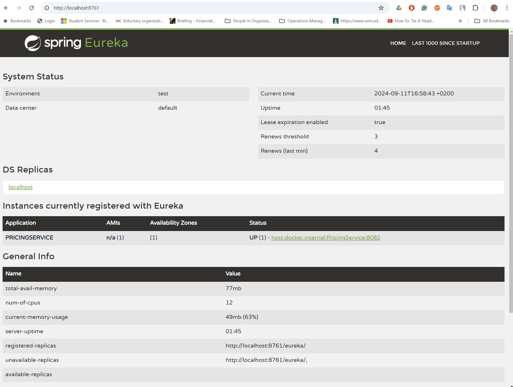

Application name is `PRICINGSERVICE`.

#### Test to generate price for a given vehicle ID

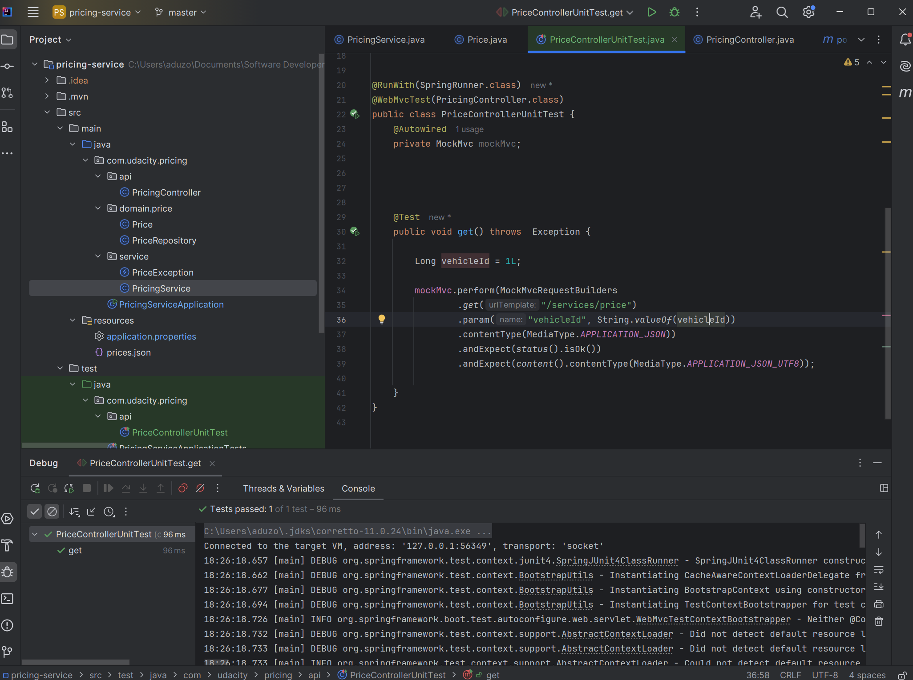

Let's break down the successful test, line by line, and explain why it worked:


- **`@RunWith(SpringRunner.class)`**: This tells JUnit to run the test with Spring's `SpringRunner`, which provides support for loading the Spring ApplicationContext. It integrates the Spring TestContext framework with JUnit.
  
- **`@WebMvcTest(PricingController.class)`**: This is a specialized test annotation used for Spring MVC tests. It sets up a minimal Spring environment focused on testing the `PricingController`. It doesn't load the full application context, making the test lighter and faster.
  
- **`@Autowired private MockMvc mockMvc`**: `MockMvc` is used to simulate HTTP requests and responses. It allows us to perform requests to the controller without actually starting a web server.


```java
@Test
public void get() throws Exception {
    Long vehicleId = 1L;

    mockMvc.perform(MockMvcRequestBuilders
            .get("/services/price")
            .param("vehicleId", String.valueOf(vehicleId))
            .contentType(MediaType.APPLICATION_JSON))
            .andExpect(status().isOk())
            .andExpect(content().contentType(MediaType.APPLICATION_JSON_UTF8));
}
```

- **`Long vehicleId = 1L;`**: The test defines a vehicle ID (`1L`) that will be passed as a query parameter in the request.

- **`mockMvc.perform(...)`**: This is where we simulate an HTTP GET request to the endpoint `/services/price`. 
    - **`.get("/services/price")`**: This specifies the endpoint we are testing.
    - **`.param("vehicleId", String.valueOf(vehicleId))`**: This adds the query parameter `vehicleId=1` to the request.
    - **`.contentType(MediaType.APPLICATION_JSON)`**: This indicates that the request and response should use the `application/json` content type.

- **Assertions (Expectations)**:
    - **`.andExpect(status().isOk())`**: This verifies that the HTTP status returned by the controller is `200 OK`.
    - **`.andExpect(content().contentType(MediaType.APPLICATION_JSON_UTF8))`**: This verifies that the content type of the response is JSON, specifically using UTF-8 encoding.


## Vehicle API Code


You'll find the code related to our Vehicles API in the `vehicles-api` folder. It serves as a REST API to maintain vehicle data and to provide a complete view of vehicle details including price and address (obtained from the location and pricing services).

Let's take a quick look through the included files - and don't worry, you won't need to implement every single one of these! Note that every package is within `com.udacity`, so we won't include that part of the package name below.

`vehicles`

**VehiclesApiApplication**

This launches the Vehicles API as a Spring Boot application. Additionally, it initializes a few car manufacturers to place in the `ManufacturerRepository`, as well as creating the web clients to connect to the Maps and Pricing services.

`vehicles.api`

**API Error**

Declares a few quick methods to return errors and other messages from the Vehicles API.


**CarController**

This is our actual REST controller for the application. This implements what happens when GET, POST, PUT and DELETE requests are received (using methods in the `CarService`), and how they are responded to (including formatting with `CarResourceAssembler`). You will implement these methods in your code.

**CarResourceAssembler**

This helps mapping the `CarController` to the `Car` class to help return the API response.

**ErrorController**

This helps to handle any invalid arguments fed to the API.

`vehicles.client.maps`

**Address**

Very similar to the `Address` file for `boogle-maps`, this declares a class for use with the `MapsClient`.

**MapsClient**

Handles the format of a GET request to the `boogle-maps` WebClient to get location data.

`vehicles.client.prices`

**Price**

Very similar to the `Price` file for `pricing-service`, this declares a class for use with the `PriceClient`.

**PriceClient**

Handles the format of a GET request to the `pricing-service` WebClient to get pricing data.

`vehicles.domain`


**Condition**

This enumerates the available values for the condition of a car (New or Used).

**Location**

This declares information about the location of a vehicle. This is not the exact same as the `Address` class used by `boogle-maps` - it's primary use is related to the storage of latitude and longitude values. Because the data, such as `address`, gathered from `boogle-maps` is annotated as `@Transient`, this data is not stored until the next time `boogle-maps` is called.

`vehicles.domain.car`

**Car**

This declares certain information about a given vehicle, mostly that more about the car entry itself (such as `CreatedAt`). Note that a separate class, `Details`, also stores additional details about the car that is more specific to things like make, color and model. Note that similar to `Location` with data like `address`, this uses a `@Transient` tag with `price`, meaning the Pricing Service must be called each time a price is desired.

**CarRepository**

This repository provide a type of data persistence while the web service runs, primarily related to vehicle information received in the `CarService`.

**Details**

Declares additional vehicle details, primarily about the car build itself, such as `fuelType` and `mileage`.

`vehicles.domain.manufacturer`

**Manufacturer**

This declares the Manufacturer class, primarily just made of a ID code and name of manufacturer.

**ManufacturerRepository**

This repository provide a type of data persistence while the web service runs, primarily to store manufacturer information like that initialized in `VehiclesApiApplication`.

`vehicles.domain`

**CarNotFoundException**

This creates a `CarNotFoundException` that can be thrown when an issue arises in the `CarService`.

**CarService**

The Car Service does a lot of the legwork of the code. It can gather either the entire list of vehicles or just a single vehicle by ID (including calls to the maps and pricing web clients). It can also save updated vehicle information. Lastly, it can delete an existing car. All of these are called by the `CarController` based on queries to the REST API. You will implement most of these methods yourself.

`test/../vehicles.api`

**CarControllerTest**

Here, the various methods performed by the CarController are performed by creating mock calls to the Vehicles API. You will implement some of these methods yourself for great practice in building your own tests.

### Instructions

* Implement the `TODOs` within the `CarService.java` and `CarController.java` files
* Add additional tests to the `CarControllerTest.java` file based on the `TODOs`.
* Implement API documentation using Swagger


#### Implement the `TODOs` CarService.java

The Car Service does a lot of the legwork of the code. It can gather either the entire list of vehicles or just a single vehicle by ID (including calls to the maps and pricing web clients). It can also save updated vehicle information. Lastly, it can delete an existing car. All of these are called by the `CarController` based on queries to the REST API. 

```java
package com.udacity.vehicles.service;

import com.udacity.vehicles.client.maps.MapsClient;
import com.udacity.vehicles.client.prices.PriceClient;
import com.udacity.vehicles.domain.car.Car;
import com.udacity.vehicles.domain.car.CarRepository;
import java.util.List;
import java.util.Optional;

import org.springframework.stereotype.Service;


/**
 * Implements the car service create, read, update or delete
 * information about vehicles, as well as gather related
 * location and price data when desired.
 */
@Service
public class CarService {

    private final CarRepository repository;
    private final MapsClient mapsClient;
    private final PriceClient pricingClient;

    public CarService(CarRepository repository, MapsClient mapsClient, PriceClient pricingClient) {
        /**
         * TODO: Add the Maps and Pricing Web Clients you create
         *   in `VehiclesApiApplication` as arguments and set them here.
         */
        this.repository = repository;
        this.mapsClient = mapsClient;
        this.pricingClient = pricingClient;

    }

    /**
     * Gathers a list of all vehicles
     * @return a list of all vehicles in the CarRepository
     */
    public List<Car> list() {
        return repository.findAll();
    }

    /**
     * Gets car information by ID (or throws exception if non-existent)
     * @param id the ID number of the car to gather information on
     * @return the requested car's information, including location and price
     */
    public Car findById(Long id) {
        /**
         * TODO: Find the car by ID from the `repository` if it exists.
         *   If it does not exist, throw a CarNotFoundException
         *   Remove the below code as part of your implementation.
         */
        Car car = repository.findById(id).orElseThrow(()->new CarNotFoundException("This car was not found"));


        /**
         * TODO: Use the Pricing Web client you create in `VehiclesApiApplication`
         *   to get the price based on the `id` input'
         * TODO: Set the price of the car
         * Note: The car class file uses @transient, meaning you will need to call
         *   the pricing service each time to get the price.
         */

        String price=pricingClient.getPrice(id);
        car.setPrice(price);

        /**
         * TODO: Use the Maps Web client you create in `VehiclesApiApplication`
         *   to get the address for the vehicle. You should access the location
         *   from the car object and feed it to the Maps service.
         * TODO: Set the location of the vehicle, including the address information
         * Note: The Location class file also uses @transient for the address,
         * meaning the Maps service needs to be called each time for the address.
         */

          car.setLocation(mapsClient.getAddress(car.getLocation()));
        return car;
    }

    /**
     * Either creates or updates a vehicle, based on prior existence of car
     * @param car A car object, which can be either new or existing
     * @return the new/updated car is stored in the repository
     */
    public Car save(Car car) {
        if (car.getId() != null) {
            return repository.findById(car.getId())
                    .map(carToBeUpdated -> {
                        carToBeUpdated.setDetails(car.getDetails());
                        carToBeUpdated.setLocation(car.getLocation());
                        return repository.save(carToBeUpdated);
                    }).orElseThrow(CarNotFoundException::new);
        }

        return repository.save(car);
    }

    /**
     * Deletes a given car by ID
     * @param id the ID number of the car to delete
     */
    public void delete(Long id) {
        /**
         * TODO: Find the car by ID from the `repository` if it exists.
         *   If it does not exist, throw a CarNotFoundException
         */
        Optional<Car> deleteCar=repository.findById(id);
        if(!deleteCar.isPresent()){
            throw new CarNotFoundException("Car is not found");
        }

        /**
         * TODO: Delete the car from the repository.
         */
        Car deleteCarNow = deleteCar.get();
        this.repository.delete(deleteCarNow);


    }
}


```

#### Implement the `TODOs` in CarController.java


This is our actual REST controller for the application. This implements what happens when GET, POST, PUT and DELETE requests are received (using methods in the CarService), and how they are responded to (including formatting with CarResourceAssembler)

```java
package com.udacity.vehicles.api;


import static org.springframework.hateoas.mvc.ControllerLinkBuilder.linkTo;
import static org.springframework.hateoas.mvc.ControllerLinkBuilder.methodOn;

import com.udacity.vehicles.domain.car.Car;
import com.udacity.vehicles.service.CarService;
import java.net.URI;
import java.net.URISyntaxException;
import java.util.List;
import java.util.stream.Collectors;
import javax.validation.Valid;

import org.springframework.hateoas.Resource;
import org.springframework.hateoas.Resources;
import org.springframework.http.ResponseEntity;
import org.springframework.web.bind.annotation.DeleteMapping;
import org.springframework.web.bind.annotation.GetMapping;
import org.springframework.web.bind.annotation.PathVariable;
import org.springframework.web.bind.annotation.PostMapping;
import org.springframework.web.bind.annotation.PutMapping;
import org.springframework.web.bind.annotation.RequestBody;
import org.springframework.web.bind.annotation.RequestMapping;
import org.springframework.web.bind.annotation.RestController;

/**
 * Implements a REST-based controller for the Vehicles API.
 */
@RestController
@RequestMapping("/cars")
class CarController {

    private final CarService carService;
    private final CarResourceAssembler assembler;

    CarController(CarService carService, CarResourceAssembler assembler) {
        this.carService = carService;
        this.assembler = assembler;
    }

    /**
     * Creates a list to store any vehicles.
     * @return list of vehicles
     */
    @GetMapping
    Resources<Resource<Car>> list() {
        List<Resource<Car>> resources = carService.list().stream().map(assembler::toResource)
                .collect(Collectors.toList());
        return new Resources<>(resources,
                linkTo(methodOn(CarController.class).list()).withSelfRel());
    }

    /**
     * Gets information of a specific car by ID.
     * @param id the id number of the given vehicle
     * @return all information for the requested vehicle
     */
    @GetMapping("/{id}")
    Resource<Car> get(@PathVariable Long id) {
        /**
         * TODO: Use the `findById` method from the Car Service to get car information.
         * TODO: Use the `assembler` on that car and return the resulting output.
         *   Update the first line as part of the above implementing.
         */
        Car car= carService.findById(id);
        return assembler.toResource(car);
    }

    /**
     * Posts information to create a new vehicle in the system.
     * @param car A new vehicle to add to the system.
     * @return response that the new vehicle was added to the system
     * @throws URISyntaxException if the request contains invalid fields or syntax
     */
    @PostMapping
    ResponseEntity<?> post(@Valid @RequestBody Car car) throws URISyntaxException {
        /**
         * TODO: Use the `save` method from the Car Service to save the input car.
         * TODO: Use the `assembler` on that saved car and return as part of the response.
         *   Update the first line as part of the above implementing.
         */
        Car savedCar = carService.save(car);

        Resource<Car> resource = assembler.toResource(savedCar);
        return ResponseEntity.created(new URI(resource.getId().expand().getHref())).body(resource);
    }

    /**
     * Updates the information of a vehicle in the system.
     * @param id The ID number for which to update vehicle information.
     * @param car The updated information about the related vehicle.
     * @return response that the vehicle was updated in the system
     */
    @PutMapping("/{id}")
    ResponseEntity<?> put(@PathVariable Long id, @Valid @RequestBody Car car) {
        /**
         * TODO: Set the id of the input car object to the `id` input.
         * TODO: Save the car using the `save` method from the Car service
         * TODO: Use the `assembler` on that updated car and return as part of the response.
         *   Update the first line as part of the above implementing.
         */
        car.setId(id);

        Car updatedCar = carService.save(car);

        Resource<Car> resource = assembler.toResource(updatedCar);
        return ResponseEntity.ok(resource);
    }

    /**
     * Removes a vehicle from the system.
     * @param id The ID number of the vehicle to remove.
     * @return response that the related vehicle is no longer in the system
     */
    @DeleteMapping("/{id}")
    ResponseEntity<?> delete(@PathVariable Long id) {
        /**
         * TODO: Use the Car Service to delete the requested vehicle.
         */
        carService.delete(id);
        return ResponseEntity.noContent().build();
    }
}

```

#### Implement `TODOs`in CarControllerTest.java

All Tests was successfull. 
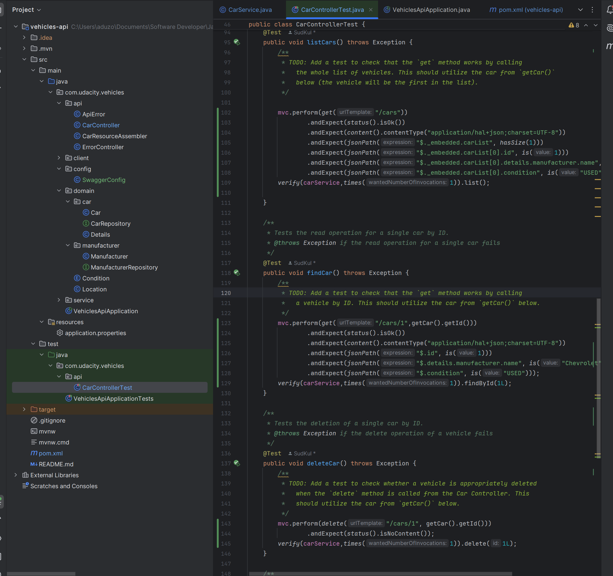

`updateCar()` method was also added, which is used for testing for Update.
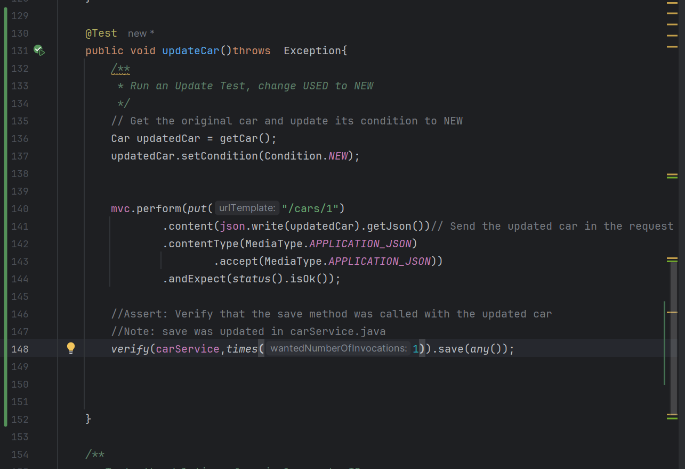

```java
package com.udacity.vehicles.api;

import static org.hamcrest.Matchers.hasSize;
import static org.hamcrest.Matchers.is;
import static org.mockito.ArgumentMatchers.any;
import static org.mockito.BDDMockito.given;
import static org.mockito.Mockito.times;
import static org.mockito.Mockito.verify;
import static org.springframework.test.web.servlet.request.MockMvcRequestBuilders.*;
import static org.springframework.test.web.servlet.result.MockMvcResultMatchers.content;
import static org.springframework.test.web.servlet.result.MockMvcResultMatchers.jsonPath;
import static org.springframework.test.web.servlet.result.MockMvcResultMatchers.status;

import com.udacity.vehicles.client.maps.MapsClient;
import com.udacity.vehicles.client.prices.PriceClient;
import com.udacity.vehicles.domain.Condition;
import com.udacity.vehicles.domain.Location;
import com.udacity.vehicles.domain.car.Car;
import com.udacity.vehicles.domain.car.Details;
import com.udacity.vehicles.domain.manufacturer.Manufacturer;
import com.udacity.vehicles.service.CarService;
import java.net.URI;
import java.util.Collections;
import org.junit.Before;
import org.junit.Test;
import org.junit.runner.RunWith;
import org.springframework.beans.factory.annotation.Autowired;
import org.springframework.boot.test.autoconfigure.json.AutoConfigureJsonTesters;
import org.springframework.boot.test.autoconfigure.web.servlet.AutoConfigureMockMvc;
import org.springframework.boot.test.context.SpringBootTest;
import org.springframework.boot.test.json.JacksonTester;
import org.springframework.boot.test.mock.mockito.MockBean;
import org.springframework.http.MediaType;
import org.springframework.test.context.junit4.SpringRunner;
import org.springframework.test.web.servlet.MockMvc;

/**
 * Implements testing of the CarController class.
 */
@RunWith(SpringRunner.class)
@SpringBootTest
@AutoConfigureMockMvc
@AutoConfigureJsonTesters
public class CarControllerTest {

    @Autowired
    private MockMvc mvc;

    @Autowired
    private JacksonTester<Car> json;

    @MockBean
    private CarService carService;

    @MockBean
    private PriceClient priceClient;

    @MockBean
    private MapsClient mapsClient;

    /**
     * Creates pre-requisites for testing, such as an example car.
     */
    @Before
    public void setup() {
        Car car = getCar();
        car.setId(1L);
        given(carService.save(any())).willReturn(car);
        given(carService.findById(any())).willReturn(car);
        given(carService.list()).willReturn(Collections.singletonList(car));
    }

    /**
     * Tests for successful creation of new car in the system
     * @throws Exception when car creation fails in the system
     */
    @Test
    public void createCar() throws Exception {
        Car car = getCar();
        mvc.perform(
                post(new URI("/cars"))
                        .content(json.write(car).getJson())
                        .contentType(MediaType.APPLICATION_JSON_UTF8)
                        .accept(MediaType.APPLICATION_JSON_UTF8))
                .andExpect(status().isCreated());
    }

    /**
     * Tests if the read operation appropriately returns a list of vehicles.
     * @throws Exception if the read operation of the vehicle list fails
     */
    @Test
    public void listCars() throws Exception {
        /**
         * TODO: Add a test to check that the `get` method works by calling
         *   the whole list of vehicles. This should utilize the car from `getCar()`
         *   below (the vehicle will be the first in the list).
         */

        mvc.perform(get("/cars"))
                .andExpect(status().isOk())
                .andExpect(content().contentType("application/hal+json;charset=UTF-8"))
                .andExpect(jsonPath("$._embedded.carList", hasSize(1)))
                .andExpect(jsonPath("$._embedded.carList[0].id", is(1)))
                .andExpect(jsonPath("$._embedded.carList[0].details.manufacturer.name", is("Chevrolet")))
                .andExpect(jsonPath("$._embedded.carList[0].condition", is("USED")));
        verify(carService,times(1)).list();

    }

    /**
     * Tests the read operation for a single car by ID.
     * @throws Exception if the read operation for a single car fails
     */
    @Test
    public void findCar() throws Exception {
        /**
         * TODO: Add a test to check that the `get` method works by calling
         *   a vehicle by ID. This should utilize the car from `getCar()` below.
         */
        mvc.perform(get("/cars/1",getCar().getId()))
                .andExpect(status().isOk())
                .andExpect(content().contentType("application/hal+json;charset=UTF-8"))
                .andExpect(jsonPath("$.id", is(1)))
                .andExpect(jsonPath("$.details.manufacturer.name", is("Chevrolet")))
                .andExpect(jsonPath("$.condition", is("USED")));
        verify(carService,times(1)).findById(1L);
    }

    @Test
    public void updateCar()throws  Exception{
        /**
         * Run an Update Test, change USED to NEW
         */
        // Get the original car and update its condition to NEW
        Car updatedCar = getCar();
        updatedCar.setCondition(Condition.NEW);


        mvc.perform(put("/cars/1")
                .content(json.write(updatedCar).getJson())// Send the updated car in the request body
                .contentType(MediaType.APPLICATION_JSON)
                        .accept(MediaType.APPLICATION_JSON))
                .andExpect(status().isOk());

        //Assert: Verify that the save method was called with the updated car
        //Note: save was updated in carService.java
        verify(carService,times(1)).save(any());


    }

    /**
     * Tests the deletion of a single car by ID.
     * @throws Exception if the delete operation of a vehicle fails
     */
    @Test
    public void deleteCar() throws Exception {
        /**
         * TODO: Add a test to check whether a vehicle is appropriately deleted
         *   when the `delete` method is called from the Car Controller. This
         *   should utilize the car from `getCar()` below.
         */
        mvc.perform(delete("/cars/1", getCar().getId()))
                .andExpect(status().isNoContent());
        verify(carService,times(1)).delete(1L);
    }

    /**
     * Creates an example Car object for use in testing.
     * @return an example Car object
     */
    private Car getCar() {
        Car car = new Car();
        car.setLocation(new Location(40.730610, -73.935242));
        Details details = new Details();
        Manufacturer manufacturer = new Manufacturer(101, "Chevrolet");
        details.setManufacturer(manufacturer);
        details.setModel("Impala");
        details.setMileage(32280);
        details.setExternalColor("white");
        details.setBody("sedan");
        details.setEngine("3.6L V6");
        details.setFuelType("Gasoline");
        details.setModelYear(2018);
        details.setProductionYear(2018);
        details.setNumberOfDoors(4);
        car.setDetails(details);
        car.setCondition(Condition.USED);
        return car;
    }
}
```

#### Implement API documentation using Swagger
* Add springfox dependencies to `pom.xml`:

```xml
<dependency>
            <groupId>io.springfox</groupId>
            <artifactId>springfox-swagger-ui</artifactId>
            <version>2.9.2</version>
        </dependency>

        <dependency>
            <groupId>io.springfox</groupId>
            <artifactId>springfox-swagger2</artifactId>
            <version>2.9.2</version>
            <scope>compile</scope>
        </dependency>
```
* Create a config package, then create a SwaggerConfig.java file:

```java
package com.udacity.vehicles.config;

import org.springframework.context.annotation.Bean;
import org.springframework.context.annotation.Configuration;
import springfox.documentation.builders.PathSelectors;
import springfox.documentation.builders.RequestHandlerSelectors;
import springfox.documentation.service.ApiInfo;
import springfox.documentation.service.Contact;
import springfox.documentation.spi.DocumentationType;
import springfox.documentation.spring.web.plugins.Docket;
import springfox.documentation.swagger2.annotations.EnableSwagger2;

import java.util.Collections;

@Configuration
@EnableSwagger2
public class SwaggerConfig {
    @Bean
    public Docket api() {
        return new Docket(DocumentationType.SWAGGER_2)
                .select()
                .apis(RequestHandlerSelectors.any())
                .paths(PathSelectors.any())
                .build();
    }

    private ApiInfo apiInfo() {
        return new ApiInfo(
                "Vehicles API",
                "This API returns a list of Vehicles.",
                "1.0",
                "http://www.udacity.com",
                new Contact("Diego Uchendu", "www.udacity.com", "myeaddress@udacity.com"),
                "License of API", "http://www.udacity.com/license", Collections.emptyList()

        );
    }
}

```

* Text the application, make sure `boogle-maps` and `pricing-service` running.
  * Then run `VehicleApiApplication`

* **POST**: 
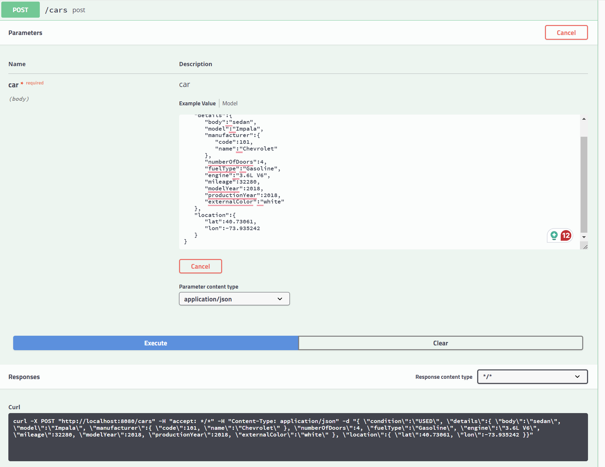
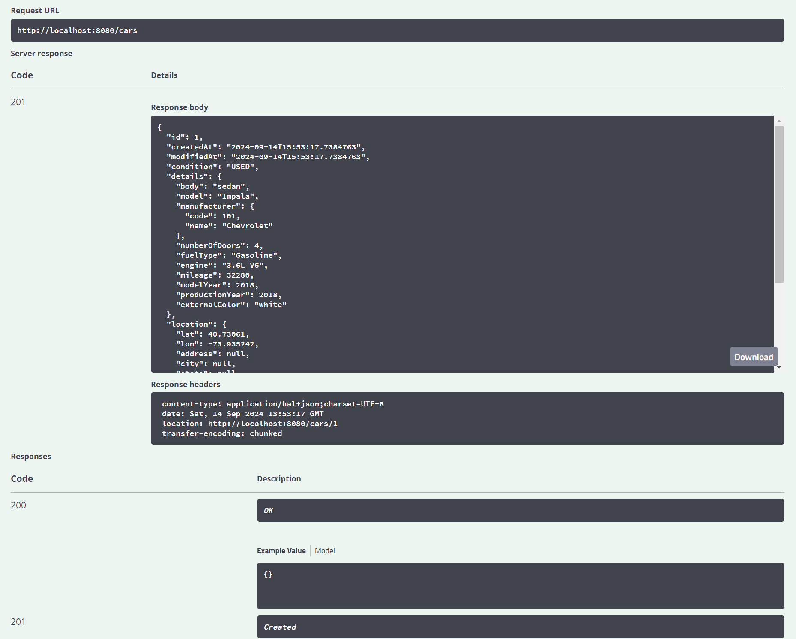
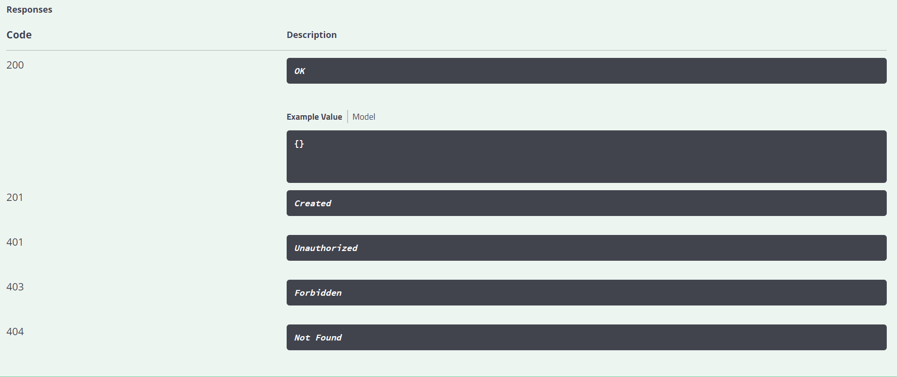

* **GET**:
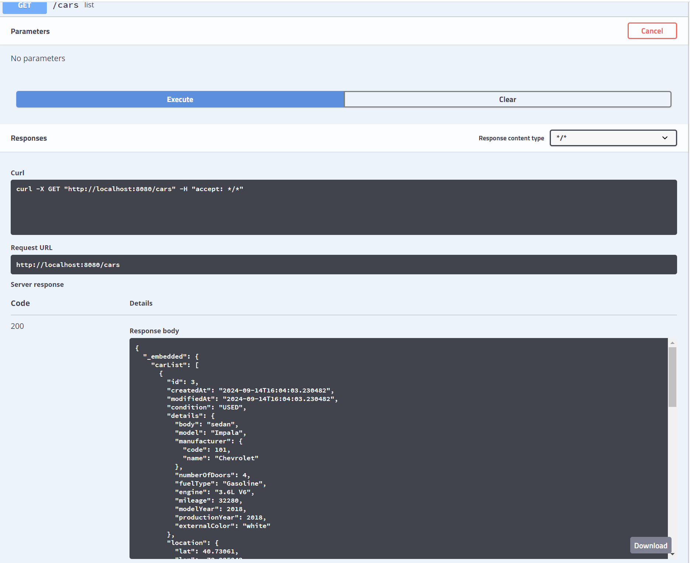

* **GET By ID**:
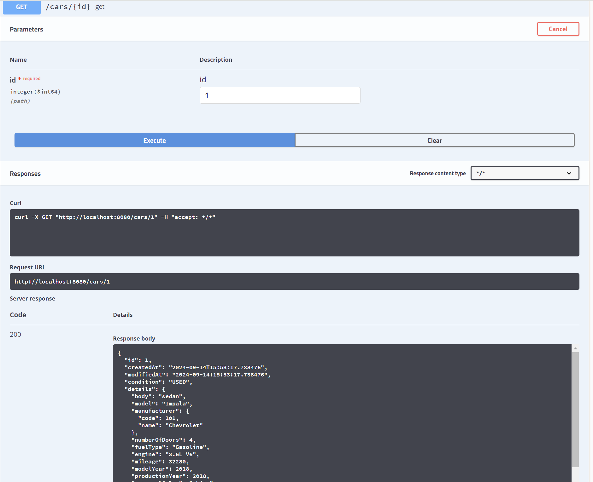
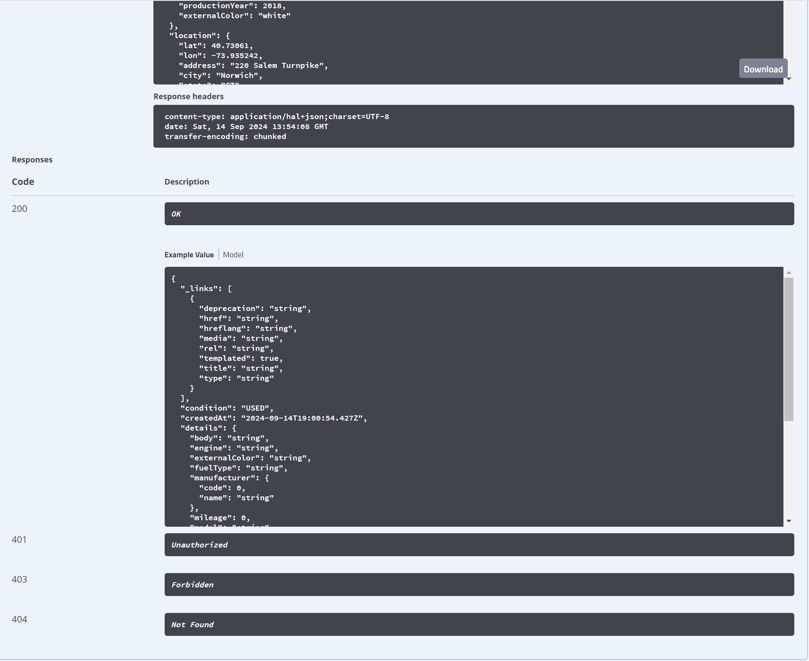


* **PUT**:

In CarService.java, `save(Car car)` method, I added This line `carToBeUpdated.setCondition(car.getCondition());` for this to be possible.

```java
public Car save(Car car) {
        /**
         * I Added Condition so that conditions can be updated.
         */
        if (car.getId() != null) {
            return repository.findById(car.getId())
                    .map(carToBeUpdated -> {
                        carToBeUpdated.setDetails(car.getDetails());
                        carToBeUpdated.setLocation(car.getLocation());
                        carToBeUpdated.setCondition(car.getCondition());
                        return repository.save(carToBeUpdated);
                    }).orElseThrow(CarNotFoundException::new);
        }

        return repository.save(car);
    }

```
Changed `condition` to `"NEW"`
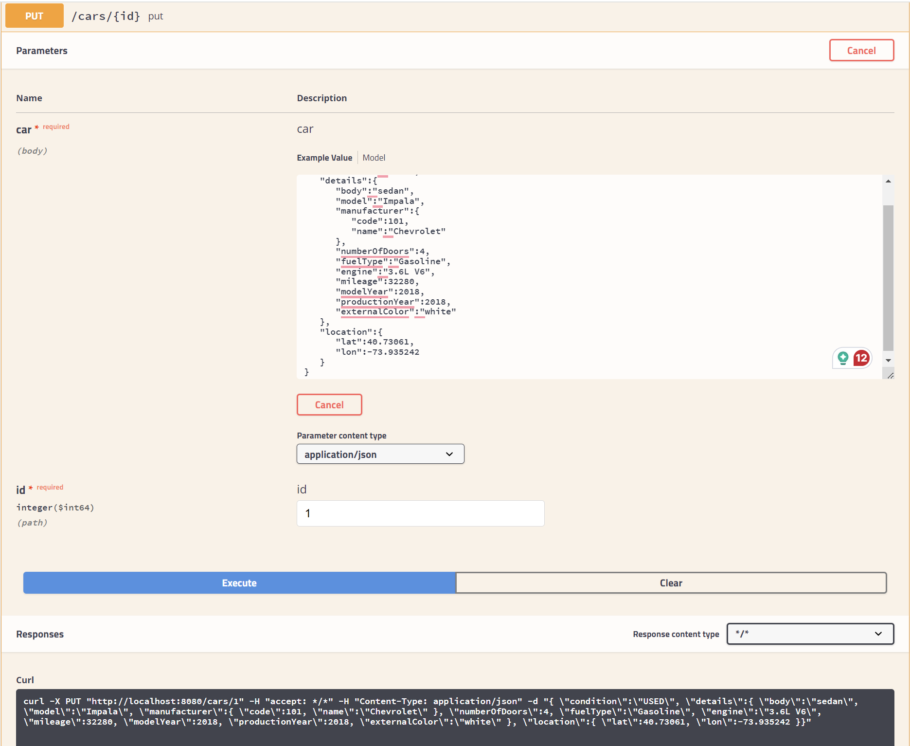
Change Reflected below:
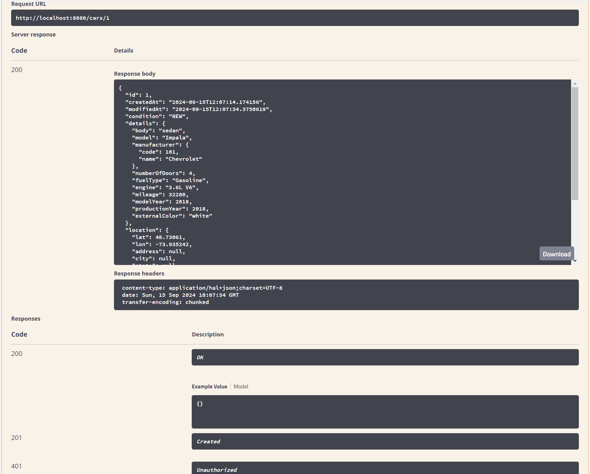

* **DELETE**:

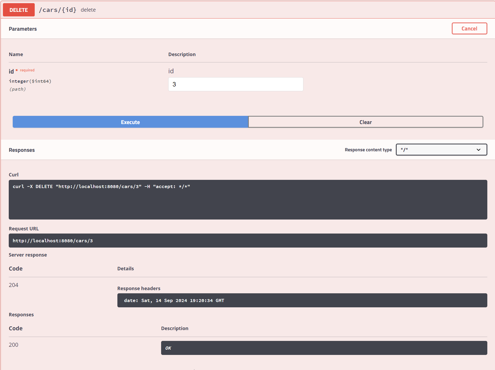
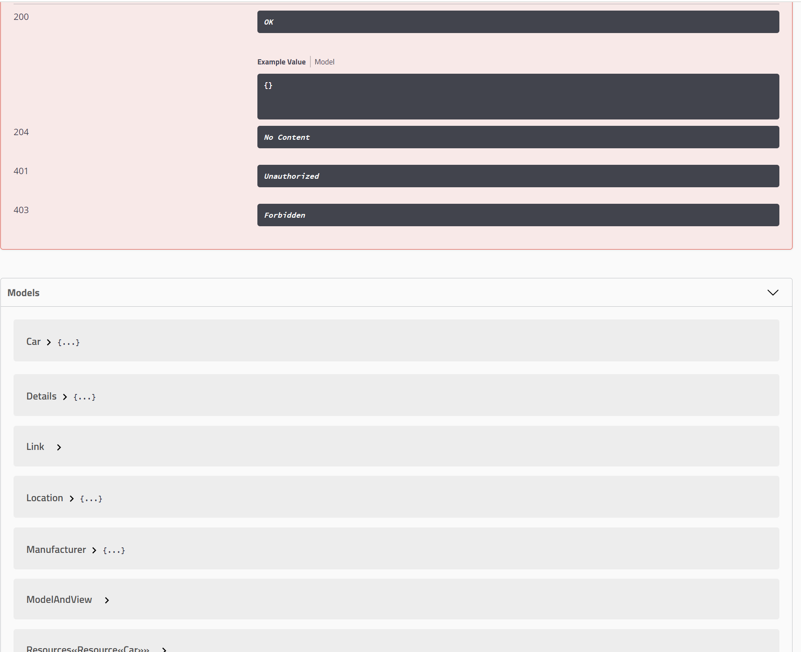


## References

1. MockMvc: https://howtodoinjava.com/spring-boot2/testing/spring-boot-mockmvc-example/
2. Udacity.com